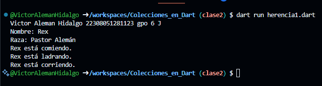

Ejemplo de una clase animal con atributos nombre y raza, y una funcion comer(), y una clase perro con herencia animal con 2 funciones: ladra() y corre(). Utiliza el lenguaje Dart

Ejemplo de Salida:
